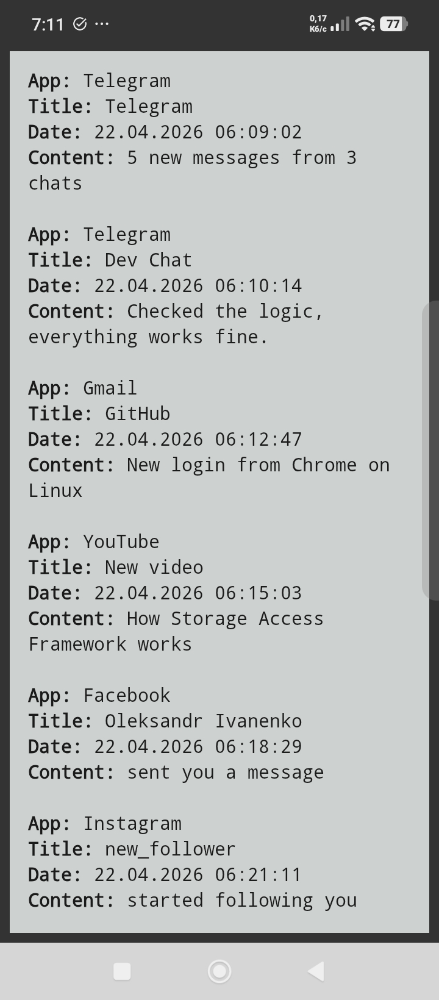
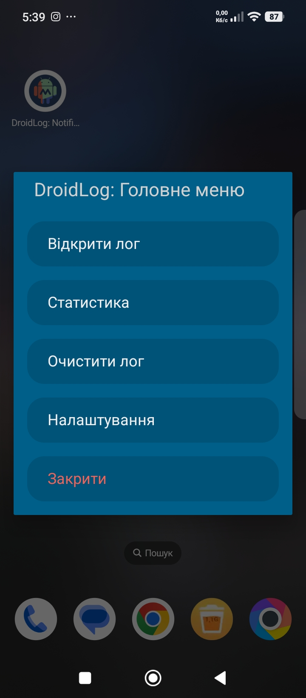
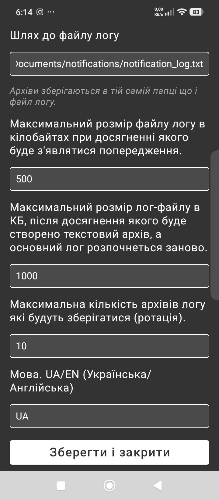
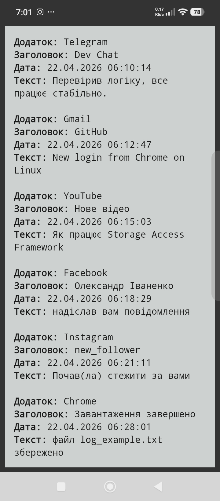

# DroidLog — smart notification logger with built-in UI

| [🇺🇸 English](#english) | [🇺🇦 Українська](#українська) |
| :--- | :--- |

<a name="english"></a>
## English Description

Advanced notification logger for MacroDroid.
### Main Functionality

- Saves notifications to a text file.

Notification record format:
```
App: App Name
Title: Notification Title
Date: 07.04.2026 07:43:00
Text: Notification Text
```
- Automatically creates plain text log archives using rotation.
- Features a graphical main menu.
- Features a graphical settings window.
- Features a window for viewing notifications in the log.
- Features a window for viewing notification statistics.
- Ability to clear the log file from the macro's main menu.
- Supports English and Ukrainian languages.

### Changelog

[Changelog_en.md](./Changelog_en.md)

### Installation

🔹 Option 1: Install from GitHub (manual import)
- Go to the Releases section.
- Download the .macro file.
- Open the MacroDroid app
- Go to Export/Import tile ➡️ Import
- Select the downloaded file from device storage
- Confirm import using the + button and enable the macro if needed

🔹 Option 2: Install from MacroDroid Template Store (recommended)
- Open MacroDroid
- Go to the Templates tab
- In search, enter: DroidLog — smart notification logger with built-in UI
- Open the template
- Tap the + icon
- Enable the macro if it is not activated automatically

### Initial Setup
After import, you can: Run macro ▶️ “Test Actions” to open menu OR create a home screen shortcut (optional)

Optimal default values are already set, but you can configure the macro parameters via Main Menu -> Settings or by changing the values of the corresponding variables in the MacroDroid interface.

Default values:

Log file path: /sdcard/Documents/notifications/notification_log.txt

Variable: **log_file_path**

Maximum log file size in kilobytes at which a warning will appear: 500 (0 - No warning will appear)

Variable: **log_size_threshold**

Maximum log file size in kilobytes at which the log will be rotated into a new text archive and a fresh log file started: 1000 (0 - Rotation will not occur)

Variable: **log_auto_archive_threshold**

Maximum number of log archives to be stored (rotation): 10

Variable: **log_archives_max_count**

Language. UA/EN (Ukrainian/English): EN

Variable: **language**

### FAQ

<details>
<summary>Where are archive files stored?</summary>

Archive files are stored in the same folder as the log file.

</details>

<details>
<summary>Is MacroDroid Pro required for this macro?</summary>

No, the macro works without MacroDroid Pro.

</details>

<details>
<summary>How is this macro better than the default Android notification log?</summary>

- Saves notifications to a text file (can be copied, shared, and analyzed).

- The default log only keeps notifications for the last 24 hours. DroidLog stores them for any period depending on configured limits.

- The default log stores only a small portion of the notification text, truncating the rest. DroidLog preserves much more content.

- Logs are accessible outside the phone (via file system, PC, etc.)

</details>

### Feedback & Support

If you have suggestions for expanding the macro's functionality or find a bug, please use [GitHub Issues](https://github.com/anatoliy-kovtun/DroidLog/issues) or contact via email: free.anatoliy.kovtun@gmail.com

### Screenshots





---

<a name="українська"></a>
## Опис українською

Розширений логер сповіщень для MacroDroid.

### Основний функціонал

- Зберігає сповіщення в текстовий файл.

Формат запису сповіщення:
```
Додаток: Назва додатку
Заголовок: Заголовок сповіщення
Дата: 07.04.2026 07:43:00
Текст: Текст сповіщення
```
- Автоматично створює текстові архіви логу за принципом ротації.

- Має своє графічне головне меню.

- Має своє графічне вікно налаштувань.

- Має своє вікно перегляду сповіщень в лозі.

- Має своє вікно перегляду статистики по сповіщеннях.

- Можливість очистити файл логу із головного меню макросу.

- Має підтримку англійської та української мови.

### Історія змін (Changelog)

[Changelog_ua.md](./Changelog_ua.md)

### Встановлення

🔹Варіант 1: Встановлення з GitHub (ручний імпорт)

- Перейдіть в розділ Releases
- Завантажте файл .macro
- Відкрийте додаток MacroDroid.
- Плитка Експорт/Імпорт -> Імпорт
- Виберіть завантажений файл у пам’яті пристрою.
- Підтвердьте імпорт кнопкою + і за потреби увімкніть макрос.

🔹Варіант 2: Встановлення з MacroDroid Template Store (рекомендовано)

- Відкрийте MacroDroid.
- Перейдіть на вкладку Шаблони.
- В пошуку введіть DroidLog — smart notification logger with built-in UI
- Відкрийте шаблон.
- Натисніть значок +
- Увімкніть макрос, якщо він не активний автоматично.

### Початкове налаштування

Після імпорту макросу в MacroDroid ви можете відкрити головне меню макросу через Тестувати дії або Тестувати макрос.
Також можете створити ярлик макросу на робочому столі телефону для швидкого запуску меню.

В налаштуваннях вже встановлені оптимальні значення за замовчуванням але ви можете налаштувати параметри макросу через Головне меню -> Налаштування або змінюючи значення відповідних змінних в інтерфейсі MacroDroid.

Значення за замовчуванням:

Шлях до файлу логу: /sdcard/Documents/notifications/notification_log.txt

Змінна: **log_file_path**

Максимальний розмір файлу логу в кілобайтах при досягненні якого буде з'являтися попередження: 500 (0 - Попередження з'являтися не буде)

Змінна: **log_size_threshold**

Максимальний розмір файлу логу в кілобайтах, після досягнення якого буде створено текстовий архів (ротація), а основний лог розпочнеться заново: 1000
(0 - Ротація логу відбуватися не буде)

Змінна: **log_auto_archive_threshold**

Максимальна кількість архівів логу які будуть зберігатися (ротація): 10

Змінна: **log_archives_max_count**

Мова. UA/EN (Українська/Англійська): EN

Змінна: **language**

### Питання та відповіді

<details>
<summary>Де знаходяться файли архівів?</summary>

Файли архівів знаходяться в тій самій папці, що і файл логу.

</details>

<details>
<summary>Чи потрібна версія MacroDroid Pro для роботи макросу?</summary>

Ні, макрос працює без версії MacroDroid Pro.

</details>

<details>
<summary>Чим цей макрос кращий за стандартний журнал сповіщень Android?</summary>

- Зберігає сповіщення у текстовий файл (можна копіювати, передавати, аналізувати).

- Стандартний журнал зберігає сповіщення тільки за останні 24 години. DroidLog зберігає за будь-який період залежно від налаштованих порогів.

- Стандартний журнал зберігає лише невеликий фрагмент тексту сповіщення, інше обрізається. DroidLog зберігає значно більше тексту.

- Доступ до логів поза телефоном (через файлову систему, ПК тощо).

</details>

### Зворотний зв'язок

Якщо у вас є пропозиції щодо розширення функціоналу макросу або ви знайшли помилку, будь ласка, використовуйте [GitHub Issues](https://github.com/anatoliy-kovtun/DroidLog/issues) або зв'яжіться зі мною через email: free.anatoliy.kovtun@gmail.com

### Скріншоти








