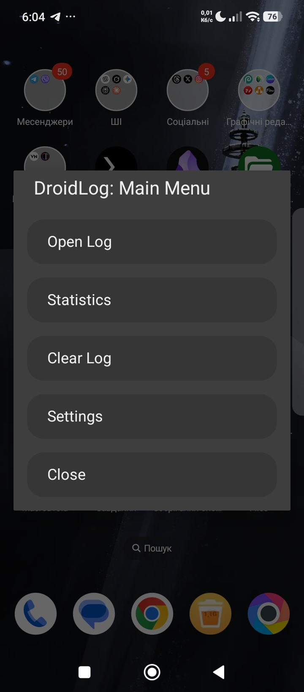
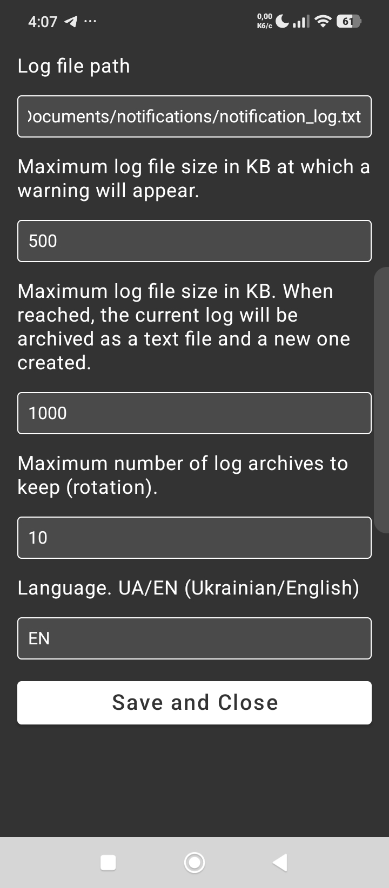
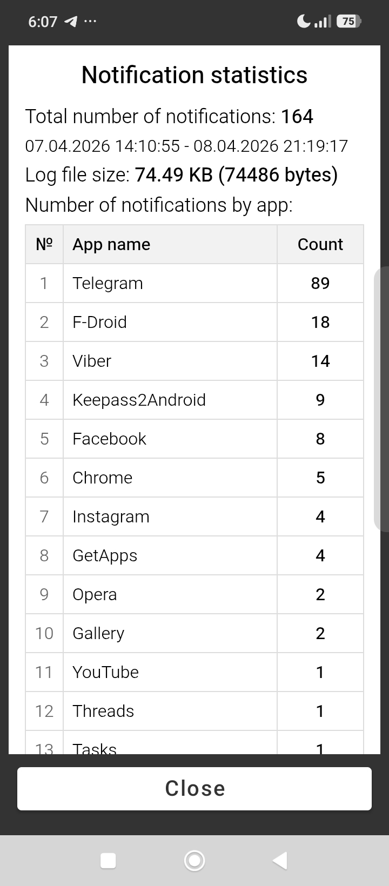
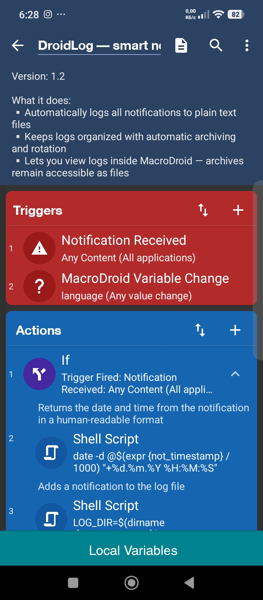
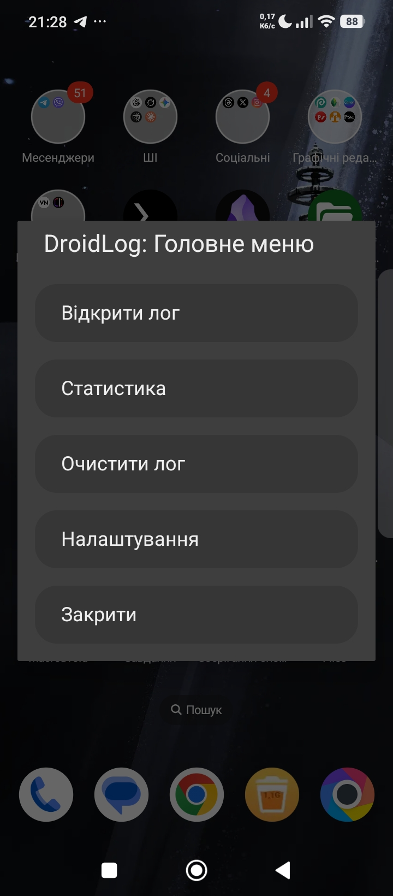
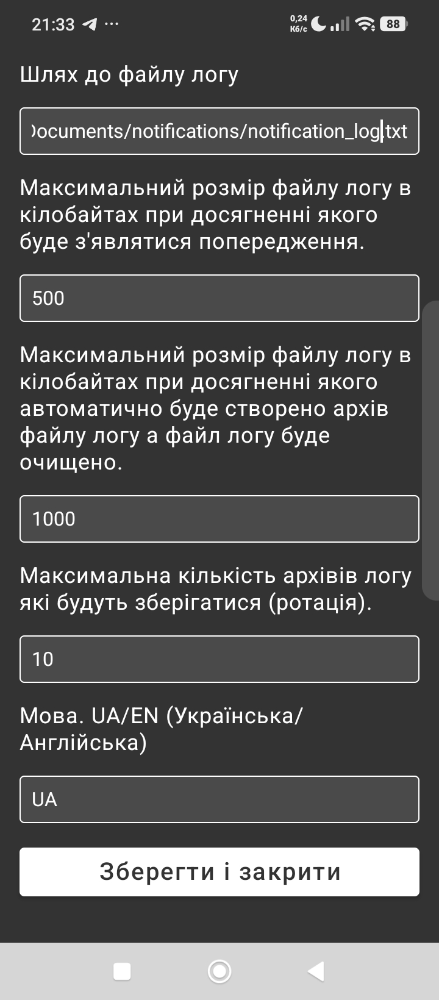
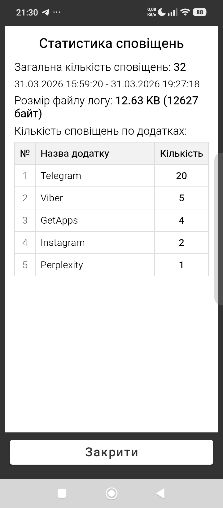

# DroidLog: Notification Storage System

| [🇺🇸 English](#english) | [🇺🇦 Українська](#українська) |
| :--- | :--- |

<a name="english"></a>
## English Description

Advanced notification logger for MacroDroid.
### Main Functionality

- Saves notifications to a text file.

Notification record format:
```
App: App Name
Title: Notification Title
Date: 07.04.2026 07:43:00
Text: Notification Text
```
- Automatically creates plain text log archives using rotation.
- Features a graphical main menu.
- Features a graphical settings window.
- Features a window for viewing notifications in the log.
- Features a window for viewing notification statistics.
- Ability to clear the log file from the macro's main menu.
- Supports English and Ukrainian languages.

### Initial Setup
After importing the macro, you must manually create a shortcut to access the macro's main menu:
1. Open MacroDroid and go to the Macros tab.
2. Find the DroidLog macro in the list.
3. Perform a long press on the macro name.
4. Select "Create home screen shortcut".
5. Place the icon on your home screen for quick access.

Optimal default values are already set, but you can configure the macro parameters via Main Menu (shortcut) -> Settings or by changing the values of the corresponding variables in the MacroDroid interface.

Default values:

Log file path: /sdcard/Documents/notifications/notification_log.txt

Variable: **log_file_path**

Maximum log file size in kilobytes at which a warning will appear: 500 (0 - No warning will appear)

Variable: **log_size_threshold**

Maximum log file size in kilobytes at which the log will be rotated into a new text archive and a fresh log file started: 1000 (0 - Rotation will not occur)

Variable: **log_auto_archive_threshold**

Maximum number of log archives to be stored (rotation): 10

Variable: **log_archives_max_count**

Language. UA/EN (Ukrainian/English): EN

Variable: **language**

### Feedback & Support

If you have suggestions for expanding the macro's functionality or find a bug, please use [GitHub Issues](https://github.com/anatoliy-kovtun/DroidLog/issues) or contact via email: free.anatoliy.kovtun@gmail.com

### Screenshots









---

<a name="українська"></a>
## Опис українською

Розширений логер сповіщень для MacroDroid.
### Основний функціонал

- Зберігає сповіщення в текстовий файл.

Формат запису сповіщення:
```
Додаток: Назва додатку
Заголовок: Заголовок сповіщення
Дата: 07.04.2026 07:43:00
Текст: Текст сповіщення
```
- Автоматично створює текстові архіви логу за принципом ротації.

- Має своє графічне головне меню.

- Має своє графічне вікно налаштувань.

- Має своє вікно перегляду сповіщень в лозі.

- Має своє вікно перегляду статистики по сповіщеннях.

- Можливість очистити файл логу із головного меню макросу.

- Має підтримку англійської та української мови.
### Початкове налаштування

Після імпорту макросу необхідно вручну створити ярлик для доступу до головного меню макросу:

1. Відкрийте MacroDroid та перейдіть на вкладку Макроси.
2. Знайдіть макрос DroidLog у списку.
3. Виконайте довге натискання на назві макросу.
4. Виберіть пункт Створити ярлик на головному екрані (Create home screen shortcut).
5. Розмістіть іконку на робочому столі для швидкого доступу.

В налаштуваннях вже встановлені оптимальні значення за замовчуванням але ви можете налаштувати параметри макросу через Головне меню (shortcut) -> Налаштування або змінюючи значення відповідних змінних в інтерфейсі Macrodroid.

Значення за замовчуванням:

Шлях до файлу логу: /sdcard/Documents/notifications/notification_log.txt

Змінна: **log_file_path**

Максимальний розмір файлу логу в кілобайтах при досягненні якого буде з'являтися попередження: 500 (0 - Попередження з'являтися не буде)

Змінна: **log_size_threshold**

Максимальний розмір файлу логу в кілобайтах, після досягнення якого буде створено текстовий архів (ротація), а основний лог розпочнеться заново: 1000
(0 - Ротація логу відбуватися не буде)

Змінна: **log_auto_archive_threshold**

Максимальна кількість архівів логу які будуть зберігатися (ротація): 10

Змінна: **log_archives_max_count**

Мова. UA/EN (Українська/Англійська): EN

Змінна: **language**

### Зворотний зв'язок

Якщо у вас є пропозиції щодо розширення функціоналу макросу або ви знайшли помилку, будь ласка, використовуйте [GitHub Issues](https://github.com/anatoliy-kovtun/DroidLog/issues) або зв'яжіться зі мною через email: free.anatoliy.kovtun@gmail.com

### Скріншоти








